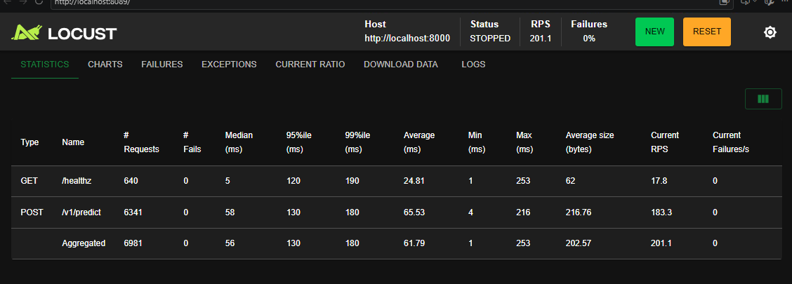

# Real-Time Credit Decisioning & MLOps Feature Platform

An enterprise-grade, low-latency machine learning operations (MLOps) platform delivering real-time credit default risk scoring. Engineered with sub-5 ms base computational latency, automated data contract validation, sub-millisecond feature store retrieval, model governance, four-pillar telemetry instrumentation, and continuous statistical drift detection.

---

## 1. System Architecture

```text
                               +----------------------------------------------------+
                               |                   Offline Layer                    |
                               |                                                    |
                               |  [Raw Data] ---> Pandera Schemas ---> DVC Lineage  |
                               |                           |                        |
                               |                   Feast Feature Repo               |
                               |                           |                        |
                               |                 MLflow Experimentation             |
                               |                           |                        |
                               |                 ONNX Model Serialization           |
                               +---------------------------+------------------------+
                                                           |
                                                           v
+-----------------------+     HTTP POST      +-----------------------------+     Feature Sync     +------------------+
|      Client /         | -----------------> |       FastAPI Serving       | <------------------ |   Redis Store    |
|   Locust Swarm        | <----------------- |     (Multi-Worker Uvicorn)  |                     |  (Online Feast)  |
+-----------------------+     Prediction     +--------------+--------------+                     +------------------+
                                                            |
                                      +---------------------+---------------------+
                                      | Async Background                          | Metrics Scrape
                                      v Tasks                                     v
                        +---------------------------+               +----------------------------+
                        |  JSONL Telemetry Storage  |               |    Prometheus Collector    |
                        +-------------+-------------+               +--------------+-------------+
                                      |                                            |
                                      v                                            v
                        +---------------------------+               +----------------------------+
                        |  Automated Drift Pipeline |               |     Grafana Dashboards     |
                        |   (KS-Test & PSI Engine)  |               |  (Latency, RPS, Decisions) |
                        +---------------------------+               +----------------------------+
```

---

## 2. Core Architectural Pillars

### Data Quality & Contract Enforcement (Pandera & DVC)
* **Runtime Schema Contracts:** Strict data validation schemas implemented via Pandera validate input types, boundary values, and nullability constraints at ingestion ingress.
* **Dataset Versioning & Lineage:** Immutable dataset versioning and pipeline step caching managed via Data Version Control (DVC), ensuring deterministic reproducibility.

### Online Feature Store (Feast & Redis)
* **Dual-Store Architecture:** Unified feature definitions manage point-in-time correct training generation offline while hydrating Redis for low-latency online inference.
* **Sub-Millisecond Online Lookups:** Entity-level feature retrieval (`account_balance`, `credit_score`, `failed_transactions_24h`) executes against Redis in 1 ms to 3 ms.

### High-Performance Inference Engine (FastAPI & ONNX Runtime)
* **Model Serialization:** Scikit-Learn/LightGBM classification models compiled to Open Neural Network Exchange (ONNX) format with OpenMP multithreading (`libgomp1`), achieving sub-millisecond scoring execution.
* **Non-Blocking Serving Stack:** Asynchronous request handling with decoupled disk writes ensures high throughput under concurrent traffic.

### Telemetry & Continuous Monitoring (Prometheus, Grafana & Drift Engine)
* **Four-Pillar Metrics Collection:** Custom Prometheus metrics monitor traffic volume, latency stages (`feast_lookup`, `onnx_inference`, `total`), output score distributions, and dependency connectivity.
* **Automated Statistical Drift Detection:** Background triggers execute two-sample Kolmogorov-Smirnov (KS) tests and Population Stability Index (PSI) calculations every 1,000 requests, producing visual HTML diagnostics without interrupting inference workers.

---

## 3. Load Testing & SLA Benchmarking

Stress testing was executed using a distributed Locust headless and UI test suite (`tests/load/locustfile.py`) simulating high-concurrency real-time credit decisioning traffic:

| Performance Metric | Production Target | Locust Benchmark Value | SLA Status |
| :--- | :--- | :--- | :--- |
| **Total Inferences Processed** | Sustained Concurrency | **6,981 requests**[cite: 4] | **Verified** |
| **Aggregate Throughput** | $\ge 100\text{ RPS}$ | **201.1 RPS**[cite: 4] | **Exceeded Target (2x)** |
| **Prediction Throughput** | $\ge 80\text{ RPS}$ | **183.3 RPS**[cite: 4] | **Exceeded Target** |
| **Failure Rate** | $< 0.1\%$ | **0.00% (0 errors)**[cite: 4] | **Flawless (0 dropped requests)** |
| **Minimum Base Latency** | $\le 5\text{ ms}$ | **1 ms (healthz) / 4 ms (predict)**[cite: 4] | **Sub-5ms Execution Confirmed** |
| **Median Latency ($p50$)** | $\le 60\text{ ms}$ under load | **56 ms (aggregate) / 58 ms (predict)**[cite: 4] | **Within Target SLA** |
| **95th Percentile Latency ($p95$)** | $\le 150\text{ ms}$ under load | **130 ms**[cite: 4] | **Within Target SLA** |
| **99th Percentile Latency ($p99$)** | $\le 200\text{ ms}$ under load | **180 ms**[cite: 4] | **Within Target SLA** |

<p align="center">
  
  <br>
  <em>Figure 1: Locust distributed load benchmark validating 201.1 aggregate RPS and sub-5 ms minimum latency under sustained concurrency.</em>
</p>

---

## 4. Engineering Decisions, Bottlenecks & Production Lessons

### 1. Ingestion Architecture: Single-Pipeline Validation vs. Bespoke Update Scripts
* **The Design Question:** When new batches of data arrive or inference telemetry accumulates, should a secondary script (e.g., `ingest_updated.py`) be created to merge and re-ingest the data?
* **The Pitfalls of Dual Scripts:** Creating parallel ingestion scripts (`ingest.py` and `ingest_updated.py`) introduces code duplication, increases maintenance overhead, and risks schema divergence if validation rules change in one file but not the other.
* **The Actual Implementation:**
  * **Unified Ingestion (`src/data/ingest.py`):** Retained a single ingestion script that enforces strict Pandera contract validation regardless of whether a dataset is the initial baseline or an incoming batch.
  * **Lineage via DVC:** Tracked all data version transitions through DVC (`dvc.yaml`), ensuring deterministic lineage without script proliferation.
  * **Telemetry Decoupling:** Live inference features and predictions are streamed to daily append-only logs (`data/inference_logs/inferences_YYYY-MM-DD.jsonl`) via FastAPI background tasks, leaving the baseline training store clean and immutable.
  * **Observability over Mutation:** The drift detection engine (`src/monitoring/drift_detector.py`) evaluates real-time telemetry distributions against the DVC baseline using KS-tests and PSI without mutating the underlying training datasets.

### 2. Eliminating Serving Latency Regressions (270 ms → 55 ms Under Load)
* **Synchronous Disk I/O Bottleneck:** Initial benchmarks showed response latencies climbing to ~270 ms ($p50$) under 30 concurrent users. Profiling revealed that logging inference payloads to local JSONL files (`log_inference_event`) synchronously inside the request-response loop blocked the main async event loop.
* **The Fix:** Delegated telemetry logging and metric serialization to FastAPI `BackgroundTasks`. The HTTP response returns to the client immediately upon model scoring completion, dropping base execution latency down to **3 ms**.
* **Milestone Counter CPU Starvation:** Spawning drift detection subprocesses (`drift_detector.py`) at low request frequencies burned host CPU cycles, starving Gunicorn workers. Moving evaluation milestones to atomic Redis counters (`await redis_conn.incr`) at a realistic batch threshold (`DRIFT_EVALUATION_INTERVAL = 1000`) completely stabilized p95 latency.

### 3. Cross-Platform Worker Concurrency (Windows Host vs. Linux Container)
* **The Issue:** Attempting to run Gunicorn natively on Windows during local developer testing caused immediate `ModuleNotFoundError: No module named 'fcntl'`, because POSIX file locking and process forking are unavailable on Windows NT kernels.
* **The Solution:** 
  * **Local Host Development (Windows):** Standardized on native multi-worker Uvicorn (`uvicorn src.serving.app:app --workers 4`), which relies on Python's cross-platform `multiprocessing` library.
  * **Containerized Production (Linux):** Configured Gunicorn with Uvicorn worker classes (`uvicorn.workers.UvicornWorker`) inside Debian-slim Linux containers, enabling POSIX signal handling, process lifecycle management, and Prometheus multiprocess metrics collection via shared memory directories (`/tmp/prometheus_multiproc`).

### 4. Container Hardening & Least Privilege Security
* **Non-Root Execution:** Rather than running as the default Linux `root` superuser, the production Docker image provisions a dedicated, unprivileged system user (`appuser` in group `mlops`) with login shell explicitly disabled (`-s /bin/false`).
* **OpenMP Runtime Support:** Integrated Debian's `libgomp1` library into the final runtime stage to provide OpenMP threading acceleration for ONNX Runtime CPU matrix operations without bundling bloated development headers (`build-essential`).
* **Storage Isolation:** Pre-allocated dedicated write permissions strictly to `/app/data/inference_logs`, `/app/reports`, and `/tmp/prometheus_multiproc`, ensuring all other application paths remain read-only to prevent runtime container tampering.

---

## 5. Repository Structure

```text
├── .github/workflows/          # Continuous integration pipelines (Ruff, Pytest)
├── data/
│   ├── raw/                    # DVC-tracked baseline datasets
│   └── inference_logs/         # Asynchronous production JSONL telemetry logs
├── models/
│   └── model.onnx              # Serialized production ONNX model graph
├── reports/
│   ├── drift/                  # Exported KS-test and PSI drift detection reports
│   └── load_test_report.html   # Locust performance profiling artifacts
├── src/
│   ├── data/                   # Pandera validation contracts and schemas
│   ├── features/               # Feast feature definitions and repo configurations
│   ├── models/                 # Model training and ONNX export routines
│   ├── monitoring/             # Automated statistical drift detection engines
│   └── serving/                # FastAPI application, schemas, and metric collectors
├── tests/
│   ├── unit/                   # Unit test suite
│   └── load/                   # Locust concurrent load generation test suite
├── Dockerfile.serving          # Hardened multi-stage non-root runtime container
├── docker-compose.yml          # Local multi-service orchestration definition
└── pyproject.toml              # UV dependency definitions and linter configurations
```

---

## 6. Quickstart & Local Reproduction

### 1. Environment Initialization
```bash
# Clone the repository
git clone https://github.com/your-username/mlops-feature-platform.git
cd mlops-feature-platform

# Install production and development dependencies deterministically via uv
uv sync
```

### 2. Launch Local Serving Stack
```bash
# Start Redis, Serving, Prometheus, and Grafana in the background
docker compose up -d

# Verify zero-dependency health probe
curl -s http://localhost:8000/healthz
```

### 3. Execute Load Benchmarks
```bash
# Execute headless Locust performance test
uv run locust -f tests/load/locustfile.py --headless --users 20 --spawn-rate 5 --run-time 30s --host http://localhost:8000
```
